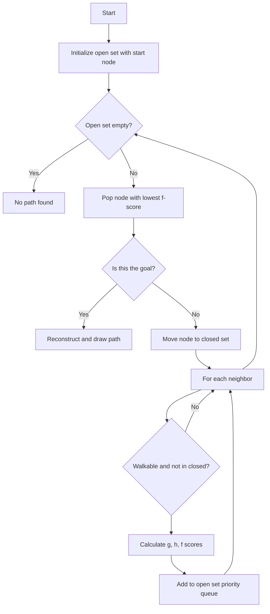
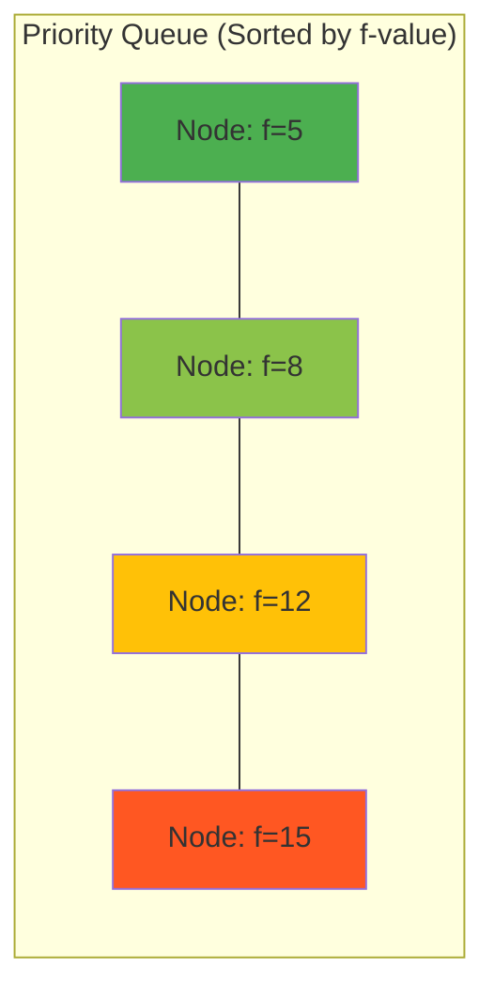

# A* Pathfinding

**A\* (A-Star) pathfinding algorithm visualization built with C# WinForms. An interactive grid-based GUI where users place obstacles, set start/end points, and watch the heuristic search find the optimal path.**

## Features

- **Interactive Grid**: Click to place walls (left-click), set start (middle-click), set end (right-click)
- **A\* Algorithm**: Complete implementation of the A\* pathfinding algorithm with Manhattan distance heuristic
- **Visual Feedback**: 
  - Grid cells colored dynamically during search
  - Found path drawn as a gradient from dark blue to lighter blue
  - Start (green) and end (red) markers displayed
- **Configurable Grid Size**: Numeric up-down control to resize the grid (divisible by 500px canvas)
- **Priority Queue**: Custom sorted linked-list implementation for the open set

## Project Structure

```
astar-pathfinding/
├── AStar_1.sln
├── AStar_1/
│   ├── Form1.cs              # Main form: UI, A* algorithm, rendering
│   ├── Form1.Designer.cs     # Designer-generated layout code
│   ├── TreeNode.cs           # Node class for search tree & priority queue
│   ├── Program.cs            # Application entry point
│   └── Properties/
│       ├── AssemblyInfo.cs
│       ├── Resources.Designer.cs
│       └── Settings.Designer.cs
└── README.md
```

## Algorithm Flow



## Core Concepts

### A\* Algorithm
A\* evaluates nodes using `f(n) = g(n) + h(n)`:
- **g(n)**: Cost from start to node `n` (path length so far)
- **h(n)**: Heuristic estimate from node `n` to goal (Manhattan distance)
- **f(n)**: Total estimated cost

### Heuristic (Manhattan Distance)
```
h(n) = |n.x - goal.x| + |n.y - goal.y|
```
This is an **admissible heuristic** (never overestimates) for grid movement with 4-directional steps, guaranteeing an optimal path.

### Priority Queue (Sorted Linked List)
The open set is a custom doubly-linked list sorted by `f(n)` ascending. The algorithm picks the node with the lowest `f` value each iteration.



### Key Methods

| Method | Purpose |
|---|---|
| `A_Star()` | Main algorithm loop |
| `hHesapla(Point)` | Calculate Manhattan distance heuristic |
| `gHesapla(TreeNode)` | Calculate path cost from start |
| `sirayaEkle(TreeNode)` | Insert into priority queue sorted by f |
| `komsuDugumler(TreeNode)` | Get 4-directional neighbors |
| `kapaliListedeVarMi(Point)` | Check if node is in closed set |
| `yolOlustur()` | Backtrack from goal to reconstruct path |

### Data Structures

- **`TreeNode`**: Represents a grid cell with coordinates `(X, Y)`, cumulative cost (`f`, `g`, `h`), parent reference (`geldigiYer`), and linked-list pointers (`ust`, `alt`, `sag`, `sol`)
- **`harita[,]`**: 2D array storing obstacle map (0=empty, 1=wall)
- **`harita_yol[,]`**: 2D array marking the final found path (2=path)

## How to Use

1. Run the application
2. Adjust grid size using the numeric up-down control
3. **Left-click** on cells to place obstacles (walls)
4. **Middle-click** to set the start position (green)
5. **Right-click** to set the end position (red)
6. Click **"A* ile Yol Bul"** to run the algorithm
7. Click **"Yenile"** to reset the grid

## Building

Open `AStar_1.sln` in Visual Studio 2008+ (retarget .NET Framework if needed) and build.
